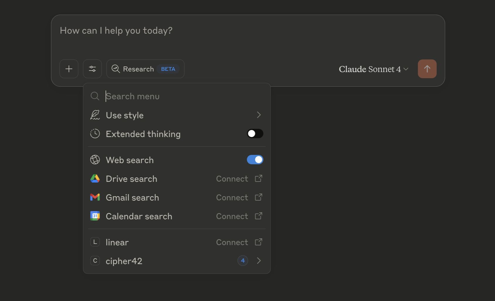

# Unified MCP Server for any Database or Data Warehouse (Via Cipher42)

**This product is currently in beta**

This is an MCP server that provides a unified API for tools such Claude (Currently Claude Desktop), Cursor, Windsurf to have a unified API to your database or data warehouse. The MCP server enables any of those tools to get deep context to your schema and help with variety of tasks from writing SQL in your IDE to understanding and visualizing data.


(The above is a short video of of Claude analyzing the [BigQuery public daset of FCC Political Ads](https://console.cloud.google.com/marketplace/product/federal-communications-commission/fcc-political-ads) and Visualizing it via this MCP and [Cipher42](https://cipher42.ai))

This MCP requires an API key from Cipher42. This MCP needs a backend such as Cipher42 as Cipher42 does a lot of the normalization and indexing to provide the unified api and return results fast to your end tool such as Claude or Cursor.

The MCP Server provides the following tools:
- `getDatasources` - The current datasources configured and indexed by [Cipher42.ai](https://cipher42.ai).
- `getSchemas` - Get the current schemas in a specific datasource.
- `getTables` - Get the tables including their schemas.
- `runQuery` - Execute a query and return the results in JSON format.

Cipher42 Currently supports: PostgreSQL, Snowflake and BigQuery

## Installation (Claude Desktop Example)

1) Sign-up to [Cipher42](https://app.cipher42.ai).
2) Connect your datasource so Cipher can index your schema and metadata.
3) Copy your personal api key from your [user settings](https://app.cipher42.ai/dashboard/user/)
4) Download Claude Desktop.
5) Edit your claude_desktop_config.json to have the following (on mac it's located at `/Users/yevgenyp/Library/Application\ Support/Claude/claude_desktop_config.json`):

```json
{
    "mcpServers": {
      "cipher42": {
        "command": "npx",
        "args": [
          "-y",
          "@yevgenyp/cipher42-mcp@v0.0.7"
        ],
        "env": {
          "CIPHER42_API_KEY": "YOUR_PERSONAL_API_KEY"
        }
      }
    }
  }
```
6) Restart Claude.
7) You should see cipher42 show up in the tools dropdown



